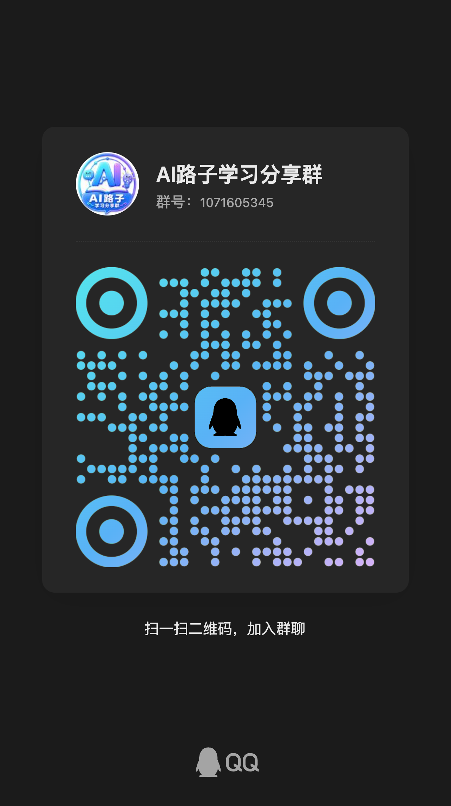

# UniApp X Skill

面向 Codex 的 UniApp X/UTS 开发技能，基于 DCloud 官方规则，从编写前开始约束 UTS、UVUE、UCSS、组件、API、插件和条件编译代码，降低 `error18`、`invoke`、类型推断失败及 App 端 CSS 不兼容等问题。

## 主要能力

- 内置 DCloud 官方 `uni-app-x-ai-rules` 规则快照，可离线使用。
- 编写前识别 UTS 类型、函数声明顺序、模板边界和平台兼容风险。
- 按低、中、高风险分级执行，避免简单修改加载整套规则或频繁检查。
- 对 `UTSJSONObject`、`Any?`、`computed`、`v-for`、动态样式、UCSS 和 API 字段变更提供通用实践约束。
- 内置常见编译错误排查手册和只读静态审计脚本。
- 仅在版本敏感、规则不明确或用户要求最新信息时查询 DCloud 官方文档。

## 当前支持

| 工具 | 自动识别 | 说明 |
| --- | --- | --- |
| Codex | 是 | 通过 `SKILL.md` 和 `agents/openai.yaml` 自动发现 |
| Cursor | 否 | 可以读取规则和运行脚本，但尚未提供 `.cursor/rules` 适配入口 |
| Claude Code | 否 | 可以读取规则和运行脚本，但尚未提供 `.claude/rules` 适配入口 |
| GitHub Copilot | 否 | 可以读取规则，但尚未提供 `.github/copilot-instructions.md` |
| 其他终端 AI | 部分 | 可以复用 `references/` 和 `scripts/`，不会自动触发 Skill |

当前版本以 Codex 为主要运行环境。后续可以在不复制核心规则的前提下增加其他 AI 工具的适配入口。

## 安装

### macOS/Linux

```bash
git clone https://github.com/Mr-xun/uniapp-x-skill.git \
  ~/.codex/skills/uniapp-x-skill
```

### Windows PowerShell

```powershell
git clone https://github.com/Mr-xun/uniapp-x-skill.git `
  "$HOME\.codex\skills\uniapp-x-skill"
```

安装后重新打开 Codex 工作区。如果技能列表中出现 `uniapp-x-skill`，说明已经被识别。

## 使用

在 UniApp X 项目中直接描述需求，Codex 会根据 Skill 描述自动判断是否启用。需要明确启用时，可以在需求中写：

```text
使用 $uniapp-x-skill 修改这个 UniApp X 页面，编写前先按 UTS/UVUE/UCSS 规则分析，按风险等级检查并验证。
```

排查编译错误示例：

```text
使用 $uniapp-x-skill 分析并修复这个 error18，不要依赖函数提升，修改后检查当前文件。
```

## 执行策略

### 低风险

适用于文案、静态值、复用现有样式和不改变类型行为的机械修改。

- 使用本地规则，不联网。
- 不加载完整 UTS 文档。
- 完成一个逻辑批次后统一检查。

### 中风险

适用于 UTS 类型/函数、`computed`、`watch`、已知接口字段归一化、`v-for`、动态样式和已知 UCSS 属性。

- 只读取相关的内置规则。
- 本地证据充分时不联网。
- 对高风险文件或小范围逻辑批次执行检查。

### 高风险

适用于陌生 API/组件/CSS、插件、原生能力、条件编译、平台差异、HBuilderX 版本行为和新的编译器问题。

- 编写前查询 DCloud 当前官方文档。
- 只使用 DCloud 官方文档和官方仓库作为在线依据。
- 在合适的功能节点运行真实编译。

## 是否会联网

默认不会。Skill 优先使用内置的 DCloud 官方规则快照。

仅在以下情况查询在线官方文档：

- 功能是否支持取决于 HBuilderX 版本或目标平台；
- API、组件、Vue 特性、CSS、插件或原生能力在本地规则中不明确；
- 编译/运行错误可能属于官方已知问题；
- 本地规则存在冲突或可能过期；
- 用户明确要求查询最新或官方确认的信息。

同一任务中已确认的官方结论会直接复用，不重复查询。没有网络时，只继续处理本地规则可以确认的部分，并明确说明未在线验证的版本敏感内容。

## 静态审计

审计脚本是遗漏检查，不是代码生成规则，也不能代替 HBuilderX 编译。

检查单个文件：

```bash
~/.codex/skills/uniapp-x-skill/scripts/audit.sh \
  /path/to/page.uvue official
```

检查整个项目：

```bash
~/.codex/skills/uniapp-x-skill/scripts/audit.sh \
  /path/to/uniapp-x-project conservative-app
```

审计模式：

- `official`：检查通用 UTS/UVUE 高风险写法。
- `conservative-app`：增加原生 App 可移植性提醒；这些是待复核项，不代表所有平台和版本都禁止使用。

API 字段新增、删除或重命名时，可以检查类型、模板、归一化和提交参数中的引用：

```bash
~/.codex/skills/uniapp-x-skill/scripts/field-reference-audit.sh \
  /path/to/affected-scope old_field
```

字段引用脚本不会假设同名字段一定属于同一个模型。对于 `code`、`line` 等通用名称，需要结合显式类型逐项确认。

## 更新官方规则

Skill 内置 DCloud 官方规则快照。需要更新时运行：

```bash
~/.codex/skills/uniapp-x-skill/scripts/update-official-rules.sh
```

更新后应检查上游差异并重新验证 Skill，不要手动修改 `references/dcloud-official/` 中的官方快照。

## 目录结构

```text
uniapp-x-skill/
├── SKILL.md
├── agents/
│   └── openai.yaml
├── references/
│   ├── compiler-playbook.md
│   ├── documentation-map.md
│   ├── official-rules.md
│   ├── practice-rules.md
│   └── dcloud-official/
└── scripts/
    ├── audit.sh
    ├── field-reference-audit.sh
    └── update-official-rules.sh
```

## 规则来源与版权说明

本 Skill 的通用开发流程、风险分级策略、UniApp X 跨项目实践规则、编译错误排查手册、审计脚本和官方规则同步机制由本项目独立开发。

为了提供可离线使用的官方语法基线，`references/dcloud-official/` 目录内置了未经修改的 DCloud 官方规则快照，来源为：

- DCloud `uni-app-x-ai-rules`：https://gitcode.com/dcloud/uni-app-x-ai-rules
- UniApp X 官方文档：https://doc.dcloud.net.cn/uni-app-x/

仅该官方规则快照沿用 DCloud 上游的 Apache License 2.0，具体来源版本和许可证见：

- `references/dcloud-official/SOURCE.md`
- `references/dcloud-official/LICENSE`

这部分上游规则的许可证不代表整个 Skill 由 DCloud 开发，也不影响本项目对其他原创内容的版权归属。

## 交流与反馈

如果你在使用本 Skill、UniApp X、Codex、ChatGPT 或其他 AI 工具时遇到安装、配置、规则编写和开发流程问题，欢迎加入「AI路子学习分享群」一起交流。

### 加入交流群

[点击链接加入群聊【AI路子学习分享群】](https://qm.qq.com/q/jmk2fZe6Gs)

QQ群号：`1071605345`

手机端点击链接通常可直接唤起 QQ，也可以扫描下方二维码加入：



群内主要交流：

- 本 Skill 的使用反馈、问题排查和改进建议
- ChatGPT、Codex 等 AI 工具的安装与使用
- Codex Skill、AI 编程和实际开发经验
- 实用网站、提效工具及 AI 学习资源

## 验证边界

Skill 可以减少常见错误，但不能承诺任意 HBuilderX 版本、目标平台和业务代码绝对零错误。

- 静态审计通过不等于编译通过。
- 编译通过不等于目标设备运行正确。
- 只有实际观察到编译结果时才会声明“已编译”。
- 只有在目标平台完成运行验证后才会声明“运行已验证”。
